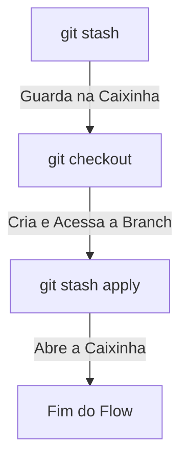

<h1 align="center">
    
</h1>

<h4 align="center">
	GED - APAE 📂 Concluído
</h4>

<p align="center">
  

  

  

  

<p align="center">
  <a href="#-sobre-o-projeto">Sobre</a> •
  <a href="#-funcionalidades">Funcionalidades</a> •
  <a href="#-tecnologias">Tecnologias</a> •
  <a href="#-autores">Autores</a> •
  <a href="#barber-como-contribuir">Como Contribuir</a> •
  <a href="#-licença">Licença</a>
</p>

# 💻 Sobre o projeto

## Projeto Integrador - APAE Criciúma (Front-End)

Este é o Front-End do projeto de gestão de documentos para a APAE de Criciúma, desenvolvido em React com TypeScript. Ele fornece uma interface amigável para o gerenciamento de arquivos, complementando o [Back-End desenvolvido em SpringBoot](https://github.com/GED-Extensao-ADS-4/ged-app).

---

# ⚙️ Funcionalidades

- [x] Controle de Documentos
- [x] Controle de Alunos


---

# 🛠 Tecnologias

[](https://reactjs.org/) [](https://react-bootstrap.netlify.app/) [](https://reactrouter.com/en/6.24.0)   

---

# 👨‍💻 Autores

<table>
  <tr>
    <td align="center"><a href="https://github.com/lucas0headshot"><br /><sub><b>Lucas Ronchi</b></sub><br /><a href="#" title="Full-Stack">👨🏻‍💻</a></a></td>
    <td align="center"><a href="https://github.com/JuannCarloss"><br /><sub><b>Juan</b></sub><br /><a href="#" title="Full-Stack / Gerente">👨🏻‍💻</a></a></td>
    <td align="center"><a href="https://github.com/LucasRBeckhauser"><br /><sub><b>Lucas Beckhauser</b></sub><br /><a href="#" title="Full-Stack">👨🏻‍💻</a></a></td>
    <td align="center"><a href="https://github.com/Douglas-z"><br /><sub><b>Douglas</b></sub><br /><a href="#" title="Full-Stack">👨🏻‍💻</a></a></td>
    <td align="center"><a href="https://github.com/RaphaelAzambuja"><br /><sub><b>Raphael</b></sub><br /><a href="#" title="Full-Stack">👨🏻‍💻</a></a></td>
  </tr>
  <tr>
    <td align="center"><a href="https://github.com/brunojucoski"><br /><sub><b>Bruno</b></sub><br /><a href="#" title="UI/UX / Tester">🎨🧪</a></a></td>
    <td align="center"><a href="https://github.com/marcus-almeida1"><br /><sub><b>Marcus</b></sub><br /><a href="#" title="Full-Stack">👨🏻‍💻</a></a></td>
    <td align="center"><a href="https://github.com/Carrerogabriel"><br /><sub><b>Gabriel Zomer</b></sub><br /><a href="#" title="Full-Stack">👨🏻‍💻</a></a></td>
    <td align="center"><a href="https://github.com/manuela-sventnickas"><br /><sub><b>Manuela</b></sub><br /><a href="#" title="Full-Stack">👩🏻‍💻</a></a></td>
    <td align="center"><a href="https://github.com/GustavomoraesJ"><br /><sub><b>Gustavo</b></sub><br /><a href="#" title="Full-Stack">👨🏻‍💻</a></a></td>
  </tr>
  <tr>
    <td align="center"><a href="https://github.com/andreminuzzi"><br /><sub><b>Andre Minuzzi</b></sub><br /><a href="#" title="Full-Stack">👨🏻‍💻</a></a></td>
    <td align="center"><a href="https://github.com/ctrl-Leonardo"><br /><sub><b>Leonardo</b></sub><br /><a href="#" title="Full-Stack">👨🏻‍💻</a></a></td>
    <td align="center"><a href="https://github.com/duckdrezis"><br /><sub><b>André Nogueira</b></sub><br /><a href="#" title="Full-Stack">👨🏻‍💻</a></a></td>
    <td align="center"><a href="https://github.com/RenanZanette"><br /><sub><b>Renan</b></sub><br /><a href="#" title="Full-Stack">👨🏻‍💻</a></a></td>
    <td align="center"><a href="https://github.com/GabrieleBronze"><br /><sub><b>Gabrielle</b></sub><br /><a href="#" title="Full-Stack">👩🏻‍💻</a></a></td>
  </tr>
  <tr>
    <td align="center"><a href="https://github.com/PamellaCastro"><br /><sub><b>Pâmela</b></sub><br /><a href="#" title="Tester">🧪</a></a></td>
    <td align="center"><a href="https://github.com/patrickfermino"><br /><sub><b>Patrick</b></sub><br /><a href="#" title="Tester">🧪</a></a></td>
    <td align="center"><a href="https://github.com/Mateusvp1"><br /><sub><b>Matheus</b></sub><br /><a href="#" title="UI/UX / Protótipo">🖼️</a></a></td>
    <td align="center"><a href="https://github.com/Caetano05"><br /><sub><b>Gabriel Caetano</b></sub><br /><a href="#" title="Gerente">👨🏻‍💻</a></a></td>
    <td align="center"><a href="https://github.com/dmsommacal"><br /><sub><b>Daniela</b></sub><br /><a href="#" title="Dona do Produto">👨🏻‍💻</a></a></td>
  </tr>
  <tr>
    <td align="center"><a href="https://github.com/CaduhPavei "><br /><sub><b>Ricardo</b></sub><br /><a href="#" title="Gerente">👨🏻‍💻</a></a></td>
  </tr>
</table>

---

# :barber: Como Contribuir

## Clonar o repositório

Clone o repositório na pasta que preferir do seu computador com o seguinte comando no seu terminal:
```bash
  git clone https://github.com/GED-Extensao-ADS-4/front-ged-app
```

## Após clonar

- Abra o projeto na sua [IDE favorita](https://medium.com/codex/the-top-10-ides-for-programmers-a-comprehensive-guide-to-choosing-the-best-ide-for-your-needs-c72e97c34591)
- Abra o terminal interno da IDE e execute o seguinte comando nele:
```bash
  npm i && npm run dev
```
- Acesse a aplicação através da URL informada pelo Vite - Exemplo: http://localhost:5173/

---

## [Padrões de Commits](https://github.com/iuricode/padroes-de-commits)

Como nosso foco nesse projeto vai ser a documentação para deixar esse lindo legado para as próximas turmas de ADS modificarem o mesmo, o mais correto a se fazer é seguirmos alguns padrões pelo menos de documentação para que eles possam se encontrar com mais facilidade no futuro, por isso pensei em seguirmos alguns padrões de commits para esse projeto

### O que é ?

Padrões de commit é uma prática onde vamos identificar o tipo do commit anotando o início dele com alguns nomes **PADRÕES**, os nomes que mais vamos usar acredito que possa vir ser:

---

**FEAT** - usado quando você cria alguma nova funcionalidade, por exemplo:

Criei um novo método de encriptar a senha na classe service, o commit seria:

**Feat: método que criptografa a senha do usuário**

---

**REFACT** - usado quando você apenas refatora algum bloco de código, sem alterar a funcionalidade do código em sí, por exemplo:

Mudei o código de salvar usuário e apenas mudei a mensagem da exception, deixando ela mais clara, o commit seria:

**Refact: mensagem da exception melhorada para maior clareza**

---

**BUILD** - usado quando você muda alguma configuração que afete o start/runtime da aplicação, por exemplo:

Adicionei a dependência do Spring Security na Aplicação, o commit seria:

**Build: dependência do Spring Security adicionado**

---

**FIX** - usado quando você ajusta algum bug no código, por exemplo:

Fiz uma mudança em um código que deveria retornar paginado de 5 em 5 e retornava de 10 em 10, o commit seria:

**Fix: ajustado para paginação 5 em 5**

---

Caso tenha se interessado no assunto e queira ver mais anotações e padrões que o mercado de trabalho segue, fica o link para leitura: <a href="https://medium.com/linkapi-solutions/conventional-commits-pattern-3778d1a1e657">Conventional Commits</a>

Caso tenham alguma dúvida, fiquem a vontade para entrar em contato comigo que eu ajudo com todo prazer, quaisquer mudanças que verem e quiserem adicionar a esse documento estão livres para faze-lá, agradeço a compreensão de todos.

---

## Flow de Versionamento (GIT e companhia)

Com os GPs tendo conhecimento dos requisitos desse MVP, os mesmo vão começar a alocar tarefas para sua equipe, com isso podemos prever que vamos ter várias pessoas trabalhando no mesmo projeto ao mesmo tempo, o que pode fazer com que ocorra **conflito nos commits.**

### O Problema
#### Conflitos:

Vamos supor que fulaninho esteja fazendo uma alteração na classe <b>``UsuarioService.java``</b> na branch **main** do projeto **(o que é bem errado e você ja vai entender o por que)**,  na hora que ele termina a tarefa dele, depois de testar e ver que esta de fato funcionando e agindo do jeito que tem que agir, ele vai querer commitar, porém na hora que ele vai fazer isso, recebe um aviso dizendo mais ou menos que: **A branch remota tem novas modificações**. Essa mensagem avisa que alguém **commitou** ou **mergeou** modificações la antes de você, seja pra roubar sua tarefa ou seja lá o que ela podia estar fazendo de alteração no projeto. E agora ?

### A solução
Temos duas soluções possíveis para esse caso, vou explicar as duas abaixo:

#### 1° Solução - Git Stash (para quando a bomba ja explodiu):

Agora, fulaninho vendo a mensagem de erro pensa "**puts, e se alguém mexeu na mesma classe que a minha ? Se eu atualizar vai sobreescrever tudo o que eu fiz!**, e o fulaninho esta mais que certo. É nesse momento que o comando <b>``git stash``</b> pode vir a calhar.

### O que o git stash faz ?
O <b>``git stash``</b> guarda todas as suas alterações locais dentro de uma "caixinha", te dando assim a liberdade de receber qualquer modificação **remota** da branch que você está atualmente. Como assim ?

Fulaninho se viu diante do problema e lembrou do comando <b>``git stash``</b>, quando ele executa esse comando, todas as suas **modificações** são "guardadas" dentro dessa caixinha e somem do arquivo atual, dando espaço para as **atualizações remotas**.

Okay, com suas mudanças dentro dessa **"caixinha"**, agora fulaninho está livre para fazer o **git pull** e receber essas mudanças sem perder o que ele já tinha feito **(o que ele fez esta dentro da caixinha do stash)**, após executar o <b>``git pull``</b> e receber as modificações, o próximo comando seria **"liberar"** essas modificações guardadas na caixinha, certo ?

**Errado!!!** Se ele fazer isso, persistiria no erro de estar modificando direto na branch **main** do projeto e continuaria se colocando em risco da mesma bomba explodir de novo.

Fulaninho agora com toda sua carga de experiência provida pelos erros que ele cometeu em sua vida, cria uma **nova branch** específica para sua tarefa **(spoiler da 2° solução)**, ele acessa essa branch e finalmente pode **"liberar"** essas mudanças nessa nova branch, dessa forma, dentro da **branch** que ele criou, ele executa o seguinte comando <b>``git stash apply``</b>, que **"abre"** aquela caixinha e coloca todas as modificações dele nessa nova branch.

O flow ficaria dessa forma:


Cansativo ? Muito!!! Olha o tanto de volta que o fulaninho teve que dar pra resolver um conflito, o certo seria evitar eles né ? E a gente pode, com a 2° solução a gente evita muitas dessas dores de cabeça.

> **Atenção:** Ensinei o flow do **git stash** por que acontece de as vezes acabarmos fazendo mudanças direto na branch **main** e ta tudo bem caso aconteça, mas o certo seria evitar isso, okay ?.

---

#### 2° Solução - Branch por Tarefa (a mais segura de todas)

Fulaninho recebeu uma nova tarefa do seu GP e agora ele quer seguir as boas práticas pra evitar a mesma dor de cabeça de antes, com isso em mente, o fulaninho cria uma branch **específica da tarefa**. Como assim ?

Hoje o fulaninho recebeu uma nova tarefa e o card dela la no trello tem o seguinte título **"Criar CRUD de usuários"**, vendo isso, o fulaninho acessa **branch main** do projeto pela IDE que ele escolheu, abre o terminal dela e executa o seguinte comando <b>``git checkout -b crud-usuarios``</b>

### O que o git checkout faz ?

O comando <b>``git checkout -b crud-usuarios``</b> vai criar e acessar essa branch nova chamada **"crud usuarios"** no projeto, onde nela o fulaninho vai estar livre pra fazer qualquer modificação ligada a essa tarefa que deu nome a branch.

Terminando de fazer as alterações, o fulaninho vai querer commitar essas mudanças **(git push)**, e **pode** acontecer o seguinte erro:

``The upstream branch of your current branch 'crud-usuarios' does not  match the name of your current branch.``

Ao ver esse erro, fulaninho, um cara muito informado, executa o seguinte comando <b>``git push --set-upstream-to origin crud-usuarios``</b>. Mas por que fazer isso ?

Ao executar o comando <b>``git checkout -b crud-usuarios``</b>, fulaninho criou uma branch **local**, isso quer dizer que essa branch **crud-usuarios** existe apenas na máquina dele, por isso ao executar o **git push** o erro citado acima ocorre, por isso executamos o <b>``git push --set-upstream-to origin crud-usuarios``</b> que força a criação dessa branch no repositório **remoto**

O flow ficaria dessa forma:


>**Atenção**: o <b>``git push --set-upstream-to origin "nome-da-branch"``</b> precisa ser executado apenas uma vez por branch.

```mermaid
graph TD
A[git checkout] -- Cria e Acessa a nova Branch --> B[git push]
B -- Tenta mandar alterações --> C[Erro Upstream Branch]
-- Branch existe apenas Local--> D[--set-upstream-to]
-- Força criação Remota --> F[Fim do flow]
```

## Comandos novos citados
|Função                              |Comando                        |
|------------------------------------|-------------------------------|
|Guarda as alterações na **caixinha**|<b>``git stash``</b>           |
|Libera as alterações da **caixinha**|<b>``git stash apply``</b>     |
|Cria e acessa uma nova branch       |<b>``git checkout -b "nome-da-branch"``</b> (sem aspas)|
|Forçar criação remota da branch     |<b>``git push --set-upstream-to origin "nome-da-branch"``</b> (sem aspas)|
## Conclusão

Seguindo as experiências que o fulaninho compartilhou com a gente, vamos evitar **MUITA** dor de cabeça com o versionamento desse projeto, por mais que não vamos fazer nada de muito grandioso *(até por que não vai dar tempo)*, ainda assim vão ser várias pessoas acessando o mesmo repositório ao mesmo tempo.
> **Atenção:** Se ainda estiver com dúvidas sobre este fluxo, pode entrar em contato comigo ou com alguém que ja tenha feito e entendido para te ajudar, melhor previnir que remediar!!

---

## Pull Requests
Segue explicativo de como usar o template para contribuir usando os PRs:

[_Use como referência a documentação do Conventional Commits_](https://github.com/iuricode/padroes-de-commits)

1. Preencher informações relevantes como:

    _Seções não usadas devem ser apagadas_
    - Descrição | **Evidenciar o que foi feito**

    - Problema Relacionado(Se houver)

    - Checklist - **Use enquanto estiver criando o PR**

    - Capturas de tela(Se houver)

    - Notas adicionais | **Use para destacar informações úteis para quem for revisar**

        Exemplo: Tarefa relacionada: [#1](link)

2. Informar revisor(es)

3. Atribuir usuários

4. Adicionar tag/label - **Indica o contexto do PR, como "bug"**

6. Revisar

7. Criar

8. Informar e solicitar aprovação

---

# 📝 Licença

Este projeto esta sobe a licença [MIT](./LICENSE).